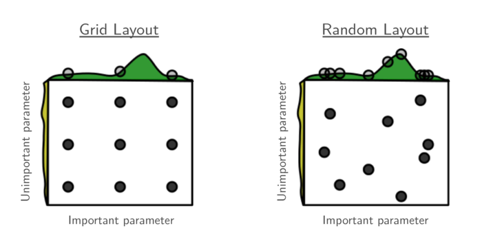

# Hyperparameter Search

Hyperparameter search involves finding acceptable values for the hyperparameters of machine learning algorithms by treating the algorithms as more-or-less opaque black boxes which produce functions.

Hyperparameters can be discrete and have nuanced interactions with accuracy and training time. Trials for a set of parameters are expensive. [AutoML](http://www.ml4aad.org/automl/) contains a collection of procedures for the search.

# Random Search

Grid search is an exponentially-growing routine which explores all combinations of parameters across their entire range, set by a human. However, the fixed-width intervals of ranges of values that are considered (even if they're log scale) can frequently be outdone by random search because of nuanced hyperparameter interactions.

A random search samples hyperparameters from their ranges. Consider Fig. 1 from [Bergstra and Bengio 2012](http://www.jmlr.org/papers/volume13/bergstra12a/bergstra12a.pdf):

# Advanced Approaches

More advanced approaches do exist ([overview blog post one](http://neupy.com/2016/12/17/hyperparameter_optimization_for_neural_networks.html), [post two](http://fastml.com/optimizing-hyperparams-with-hyperopt/), and a [small benchmark](https://arxiv.org/abs/1603.09441)):

* Gaussian Process Hyperparameter Optimization by [Snoek et al 2012](https://arxiv.org/abs/1206.2944) in [spearmint](https://github.com/JasperSnoek/spearmint) or [bayesopt](https://github.com/rmcantin/bayesopt), with older versions [MOE](https://github.com/Yelp/MOE) and [space](http://www.schonlau.net/space.html).
* Tree-structured Parzen Estimators by [Bergstra et al 2011](https://papers.nips.cc/paper/4443-algorithms-for-hyper-parameter-optimization) in [hyperopt](http://jaberg.github.io/hyperopt/)
* Sequential model based optimization by [Hutter et al 2011](http://aad.informatik.uni-freiburg.de/papers/11-LION5-SMAC.pdf) in [SMAC](http://www.cs.ubc.ca/labs/beta/Projects/SMAC/)

